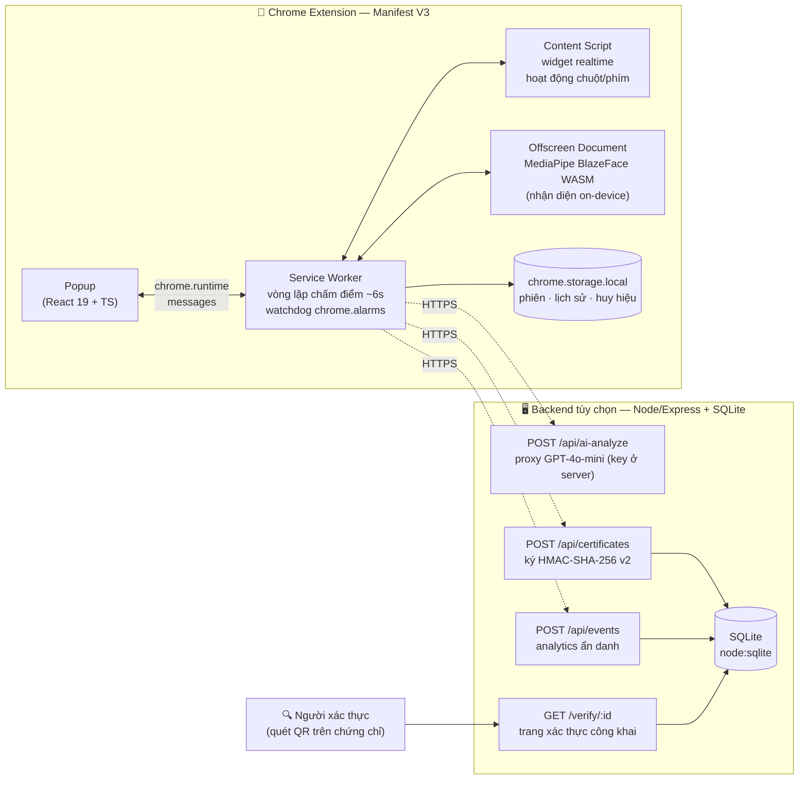
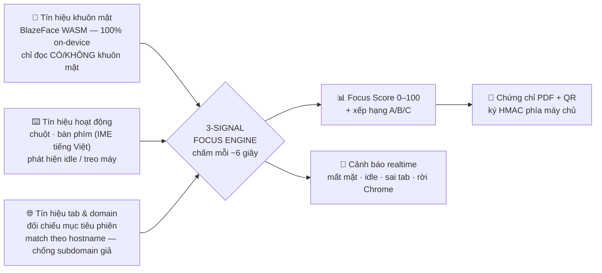
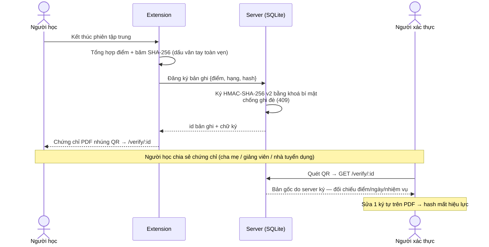

<div align="center">


# FocusProof

### Chứng chỉ Tập trung Thông minh & Xác thực

**Chrome Extension (Manifest V3) đo mức độ tập trung bằng 3 tín hiệu hành vi độc lập,**
**rồi biến mỗi giờ học/làm việc thành một chứng chỉ số có thể xác thực công khai.**


*"Azota chứng minh bạn không gian lận lúc thi — FocusProof chứng minh bạn có nỗ lực lúc học."*

</div>

---

## 📋 Mục lục

- [Vì sao FocusProof?](#-vì-sao-focusproof)
- [Kiến trúc hệ thống](#-kiến-trúc-hệ-thống)
- [3-Signal Focus Engine](#-3-signal-focus-engine)
- [Luồng xác thực chứng chỉ](#-luồng-xác-thực-chứng-chỉ)
- [Tính năng](#-tính-năng)
- [Cải tiến theo góp ý Ban giám khảo](#-cải-tiến-theo-góp-ý-ban-giám-khảo)
- [Tech Stack](#-tech-stack)
- [Cài đặt & Chạy thử](#-cài-đặt--chạy-thử)
- [Backend (tùy chọn)](#-backend-tùy-chọn)
- [Kiểm thử & Chất lượng](#-kiểm-thử--chất-lượng)
- [Cấu trúc dự án](#-cấu-trúc-dự-án)
- [Bảo mật & Quyền riêng tư](#-bảo-mật--quyền-riêng-tư)
- [Changelog](#-changelog)

---

## 🧠 Vì sao FocusProof?

85% sinh viên thừa nhận thường xuyên mất tập trung vì điện thoại và mạng xã hội — nhưng vấn đề lớn hơn là **không ai chứng minh được giờ học thật**: cha mẹ, giảng viên, nhà tuyển dụng, quỹ học bổng đều không có công cụ kiểm chứng. Các app hiện có (Pomodoro, Forest, YPT) chỉ **đếm giờ tự khai** — treo máy đi chơi vẫn được tính là "tập trung".

FocusProof giải quyết bằng cách **đo hành vi thật** và **phát hành bằng chứng xác thực được**:

| | Công cụ đếm giờ | **FocusProof** |
|---|---|---|
| Đo tập trung | ⏱ tự khai, dễ gian lận | ✅ 3 tín hiệu hành vi độc lập, chấm mỗi ~6 giây |
| Bằng chứng | ❌ không có | ✅ chứng chỉ PDF + QR, máy chủ ký HMAC |
| Riêng tư | — | ✅ AI khuôn mặt chạy 100% on-device, 0 ảnh rời máy |
| Khi mất mạng | — | ✅ hoạt động đầy đủ offline (AI insight có engine cục bộ) |

---

## 🏗 Kiến trúc hệ thống

**Nguyên tắc: xử lý tại thiết bị — xác thực tại máy chủ.** Extension hoạt động đầy đủ offline; backend là lớp xác thực cộng thêm, không phải phụ thuộc cứng.



---

## 🎯 3-Signal Focus Engine

Lõi công nghệ độc quyền: **ba tín hiệu độc lập kiểm chứng chéo** (triangulation). Giả một tín hiệu thì dễ — giả cả ba cùng lúc gần như phải… học thật.



> **Khiêm tốn khoa học:** FocusProof đo *điều kiện và hành vi* tập trung (hiện diện + tương tác + đúng tab) — **không** tuyên bố đọc trạng thái nhận thức hay cảm xúc (vùng đã bị EU AI Act giới hạn trong giáo dục).

---

## 🔏 Luồng xác thực chứng chỉ

Điểm khác biệt cốt lõi so với mọi focus app: chứng chỉ **không thể giả mạo**, vì bản gốc do máy chủ lưu và ký.



> **Trung thực kỹ thuật:** SHA-256 phía client là *dấu vân tay toàn vẹn dữ liệu* (integrity), không phải chữ ký số. Chữ ký thật là **HMAC do server thực hiện** — client không bao giờ giữ khoá bí mật.

---

## ✨ Tính năng

### Core Engine
- **Face Detection** — MediaPipe BlazeFace chạy 100% local (WASM, GPU → CPU fallback); chỉ đọc confidence, không lưu ảnh
- **Activity Tracking** — 10 loại sự kiện (keydown/IME, click, mousemove, scroll, paste…); **mặc định KHÔNG thu nội dung gõ**, không bao giờ đọc ô mật khẩu/OTP/thẻ
- **Tab & Domain Tracking** — match theo hostname/subdomain (chống lách kiểu `fake-notion.so.evil.com`), phát hiện rời Chrome qua `windows.getLastFocused`
- **4 chế độ mục tiêu** (Study / Work / Programming / Video Lecture) + custom domain + **Strict Mode thực thi thật** (phạt điểm khi đổi tab)
- **Cảnh báo realtime 4 loại** — face-lost, idle, tab-violation, outside-chrome — **đếm thật, lưu thật vào phiên**
- **Camera-Off Mode** — không camera vẫn chấm điểm (tự điều chỉnh trọng số)
- **Watchdog `chrome.alarms`** — phiên sống sót kể cả khi Service Worker bị Chrome kill

### Trải nghiệm & minh bạch
- **Consent Screen** trước phiên đầu — liệt kê đúng dữ liệu thu thập, camera & nội dung gõ là 2 opt-in riêng (chuẩn Chrome Web Store)
- **Floating Widget** — Shadow DOM, kéo thả (đã fix bug phình màn hình), minimize, hỗ trợ cảm ứng
- **7 màn hình React** + Dark theme (system/light/dark) + ARIA accessibility
- **Gamification** — 10 huy hiệu (badge Marathon xét theo thời gian thực)

### Đầu ra & phân tích
- **Chứng chỉ PDF 2 trang** — điểm, biểu đồ domain, signal breakdown, QR xác thực, watermark, font Việt
- **AI Insight 2 tầng** — GPT-4o-mini qua backend proxy (key ở server); **tự rơi về engine phân tích offline** khi không có mạng/backend → không bao giờ lỗi trước giám khảo; UI ghi rõ nguồn phân tích
- **Analytics + Error logging** — privacy-first (không URL/PII), ring buffer cục bộ, panel trong Diagnostic Dashboard
- **History** — heatmap 7 ngày, biểu đồ, lọc, **export CSV** + **Backup/Restore JSON** (versioning + validate)

---

## ✅ Cải tiến theo góp ý Ban giám khảo

Toàn bộ góp ý vòng trước đã được kiểm chứng lại và xử lý — **mỗi lỗi sửa xong đều kèm test hồi quy**:

| # | Góp ý | Trạng thái | Cách xử lý | Bằng chứng |
|---|---|:---:|---|---|
| 1 | Bug thống kê cảnh báo luôn = 0 | ✅ | Lưu `alerts[]` vào phiên ngay trong vòng lặp lấy mẫu; thống kê/AI/chứng chỉ đọc số thật | 3 test hồi quy trong `focus.test.ts` |
| 2 | AI hỏng khi demo (key trống) | ✅ | Engine phân tích offline (`local-analysis.ts`) + backend proxy, tự fallback | 8 test; AI không bao giờ báo lỗi |
| 3 | Chưa có backend | ✅ | `server/` Express + **SQLite thật** (`node:sqlite`), 5 endpoint | 13/13 test server PASS |
| 4 | CSDL mất khi gỡ, không xác thực | ✅ | Server lưu + ký HMAC bản ghi chứng chỉ, trang `/verify/:id` công khai | `server/index.js` + test |
| 5 | Quyền `<all_urls>` quá rộng | ✅ Giải trình | Justification đầy đủ + kế hoạch thu hẹp 2 bước | [`docs/PERMISSIONS_AND_SECURITY.md`](docs/PERMISSIONS_AND_SECURITY.md) |
| 6 | Thiếu analytics + error logging | ✅ | `analytics.ts` phủ background/popup/offscreen/content-script + panel dashboard | 6 test |
| 7 | "Chữ ký SHA-256" chưa phải chữ ký | ✅ | Đổi nhãn trung thực ("Integrity") + chữ ký HMAC thật ở server | 7 test |
| 8 | Gói build nặng, WASM lặp 2 nơi | ✅ | Plugin dọn bản trùng sau build | **41MB → 22MB** (−46%), zip nộp 7.7MB |
| 9 | Đo hiệu năng thật (CPU/RAM) | 🔶 | Có công cụ + phương pháp đo (Chrome Task Manager, phiên 60–90') | Panel Hiệu năng trong Diagnostic |
| 10 | Link demo/GitHub/video trống | ✅ | Repo này + checklist chốt link trước ngày nộp | [`docs/BAO_CAO_CAI_TIEN_FOCUSPROOF.md`](docs/BAO_CAO_CAI_TIEN_FOCUSPROOF.md) |

Ngoài ra, đợt audit nội bộ (30 AI agent đọc toàn bộ mã) phát hiện và đã sửa thêm: bug kéo widget phình màn hình, Strict Mode không thực thi, cờ outside-chrome bị reset oan, lọc ô mật khẩu cho activity tracking, gỡ API key khỏi bundle client (+ CI `check-no-secrets` chặn tái diễn), consent screen, watchdog alarms, backup/restore, CI/CD. Chi tiết: [`docs/DANH_GIA_VONG_CHUNG_KET.md`](docs/DANH_GIA_VONG_CHUNG_KET.md).

---

## 🛠 Tech Stack

| Layer | Công nghệ |
|-------|-----------|
| **Build** | Vite 5 + @crxjs/vite-plugin + plugin prune WASM trùng |
| **UI** | React 19 + TypeScript strict |
| **Face Detection** | @mediapipe/tasks-vision 0.10.14 (BlazeFace, WASM local) |
| **PDF / QR** | jsPDF + html2canvas + qrcode |
| **AI** | GPT-4o-mini qua backend proxy · engine phân tích offline thuần TS |
| **Backend** | Node 18+ / Express 4 · SQLite (`node:sqlite`) · HMAC-SHA-256 |
| **Testing** | Vitest 2.1 + jsdom + Chrome API mocks (266 test) · `node --test` (13 test) |
| **Chất lượng** | ESLint 9 · Prettier 3 · husky + lint-staged · GitHub Actions CI · `check-no-secrets` |

---

## 🚀 Cài đặt & Chạy thử

### 1. Clone & install

```bash
git clone https://github.com/bminhnemhoi/FocusProof_extension.git
cd FocusProof_extension
npm install   # postinstall tự copy MediaPipe WASM/model
```

### 2. Cấu hình (tùy chọn — bỏ qua vẫn chạy đầy đủ)

```bash
cp .env.example .env
```

`.env` chỉ chứa **3 URL** trỏ tới backend (không có API key nào ở client):

```ini
VITE_AI_PROXY_URL=      # proxy AI — key nằm ở server
VITE_VERIFY_BASE_URL=   # trang xác thực QR
VITE_ANALYTICS_URL=     # endpoint analytics ẩn danh
```

> Để trống tất cả → extension chạy **offline-first**: AI dùng engine cục bộ, QR dùng hash tự chứng thực.

### 3. Build & nạp vào Chrome

```bash
npm run build        # tsc + vite build → dist/ (~22MB)
```

1. Mở `chrome://extensions/` → bật **Developer mode**
2. **Load unpacked** → chọn thư mục `dist/`
3. Ghim icon FocusProof lên toolbar → bấm để bắt đầu phiên đầu tiên

### 4. Đóng gói nộp / phát hành

```bash
npm run package      # → focusproof-v1.0.1.zip (7.7MB, đã quét secret)
```

---

## 🖥 Backend (tùy chọn)

```bash
cd server
cp .env.example .env    # điền OPENAI_API_KEY + CERT_SIGNING_SECRET (≥32 ký tự)
npm install
npm start               # http://localhost:8787
npm test                # 13/13 test PASS
```

| Endpoint | Vai trò |
|---|---|
| `POST /api/ai-analyze` | Proxy GPT-4o-mini — API key chỉ nằm ở server |
| `POST /api/certificates` | Lưu + ký HMAC-SHA-256 v2 bản ghi chứng chỉ (chống ghi đè 409) |
| `GET /verify/:id` | Trang xác thực công khai — quét QR là ra bản gốc |
| `POST /api/events` | Nhận analytics + error log ẩn danh |
| `GET /api/stats` | Thống kê tổng hợp |

Hướng dẫn deploy (Render/Railway/Fly): xem [`server/README.md`](server/README.md).

---

## 🧪 Kiểm thử & Chất lượng

```bash
npm test              # 266/266 test client (17 file)
npm run lint          # ESLint — 0 lỗi
npm run type-check    # tsc strict — 0 lỗi
npm run build         # build production
npm run check:secrets # quét API key lộ trong dist
cd server && npm test # 13/13 test server
```

Kết quả kiểm chứng hiện tại (chạy lại được từ mã nguồn):

```
Lint:        0 lỗi                          ✅
Type-check:  0 lỗi (TypeScript strict)      ✅
Client test: 266/266 PASS (17 file)         ✅
Server test: 13/13 PASS                     ✅
Build:       OK — dist 22MB (từ 41MB)       ✅
Secrets:     0 key trong dist               ✅
CI:          GitHub Actions (lint+tsc+test+build)  ✅
```

Kiểm thử thủ công theo kịch bản: [`MANUAL_TEST_CHECKLIST.md`](MANUAL_TEST_CHECKLIST.md).

---

## 📁 Cấu trúc dự án

```
FocusProof_extension/
├── src/
│   ├── background/          Service Worker: session, sampling, tab-tracker, offscreen
│   ├── content-script/      Widget Shadow DOM + activity tracking (IME-aware)
│   ├── offscreen/           Camera + MediaPipe BlazeFace (GPU→CPU fallback)
│   ├── popup/               React 19: Start/Camera/Running/Result/History/
│   │                        Diagnostic/Consent + ErrorBoundary
│   ├── utils/               focus (chấm điểm) · goal-evaluator · gamification ·
│   │                        certificate + certificate-signing · ai-analysis ·
│   │                        local-analysis (AI offline) · analytics · consent ·
│   │                        storage (backup/restore) · csv · qr-code · voice-note
│   └── __tests__/           17 file — 266 test
├── server/                  Backend Express + SQLite (5 endpoint, 13 test)
├── public/                  icons · fonts · MediaPipe WASM/model · trang diagnostic
├── scripts/                 package.mjs · check-no-secrets.mjs · copy-mediapipe.mjs
├── .github/workflows/ci.yml GitHub Actions: lint + type-check + test + build
├── docs/                    Báo cáo cải tiến · đánh giá · permissions & security ·
│                            hồ sơ Web Store · slide thuyết trình
└── manifest.json            Manifest V3
```

---

## 🛡 Bảo mật & Quyền riêng tư

**5 điều FocusProof KHÔNG làm:**

1. **KHÔNG ghi hình** — không một frame ảnh nào rời thiết bị (BlazeFace chạy on-device, chỉ đọc confidence)
2. **KHÔNG đọc cảm xúc** / trạng thái tâm lý — chỉ xác nhận 3 sự kiện hành vi khách quan
3. **KHÔNG thu nội dung gõ phím mặc định** — opt-in riêng; không bao giờ đọc ô mật khẩu/OTP/thẻ
4. **KHÔNG nhúng API key vào client** — key chỉ ở server; CI có bước `check-no-secrets` chặn tái diễn
5. **KHÔNG theo dõi âm thầm** — người học tự bấm bắt đầu, widget hiển thị suốt phiên, consent 2 opt-in

Chi tiết kỹ thuật + giải trình từng quyền (`<all_urls>`, `tabs`, `offscreen`…): [`docs/PERMISSIONS_AND_SECURITY.md`](docs/PERMISSIONS_AND_SECURITY.md)

---

## 📝 Changelog

### v1.0.1 (07/2026) — Hardening round trước vòng chung kết
- 🔒 Gỡ API key khỏi bundle client → backend proxy + engine AI offline; thêm `check-no-secrets`
- 🐛 Fix bug thống kê cảnh báo = 0 · bug kéo widget · Strict Mode thực thi thật · cờ outside-chrome
- 🗄 Backend SQLite thật + ký HMAC v2 + trang `/verify/:id` + 13 test
- 🪪 Consent screen 2 opt-in (chuẩn Web Store) · lọc ô mật khẩu cho activity tracking
- 📈 Analytics + error logging privacy-first · Backup/Restore JSON · watchdog `chrome.alarms`
- 📦 Build 41MB → 22MB (prune WASM trùng) · CI GitHub Actions · husky
- ✅ Test: 184 → **266 client + 13 server**

### v1.0.0 (04/2026) — Bản phát hành đầu tiên
- 3-Signal Engine · 4 chế độ mục tiêu · cảnh báo realtime · widget nổi · chứng chỉ PDF 2 trang
- AI Analysis song ngữ · gamification 10 huy hiệu · history + CSV · dark theme · 184 test

---

<div align="center">

**Built with ❤️ using React 19 + TypeScript + Vite 5 — verified by 279 automated tests**

*FocusProof — Tập trung không còn là cảm giác, mà là bằng chứng có thể xác thực.*

</div>
